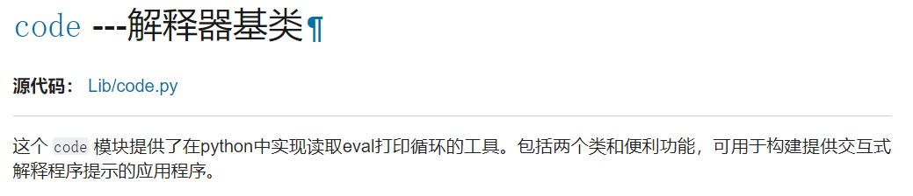
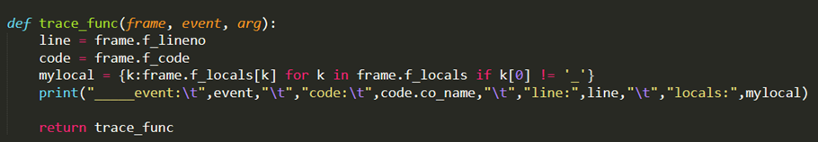
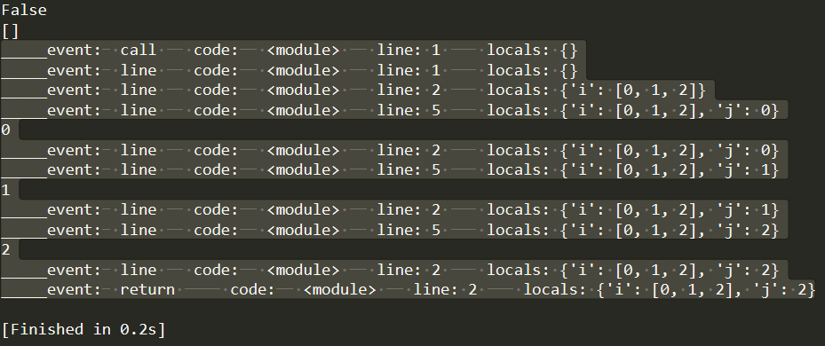
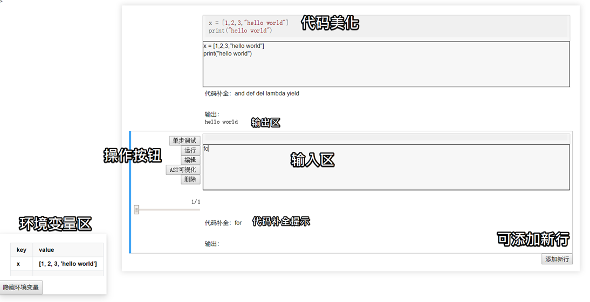
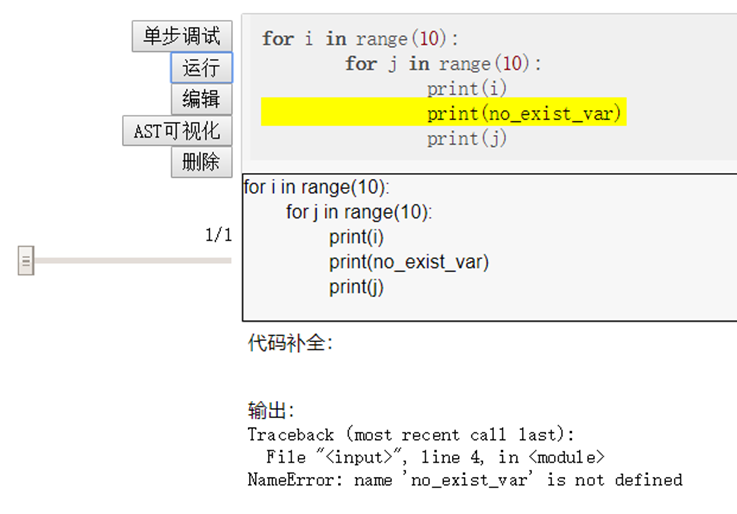
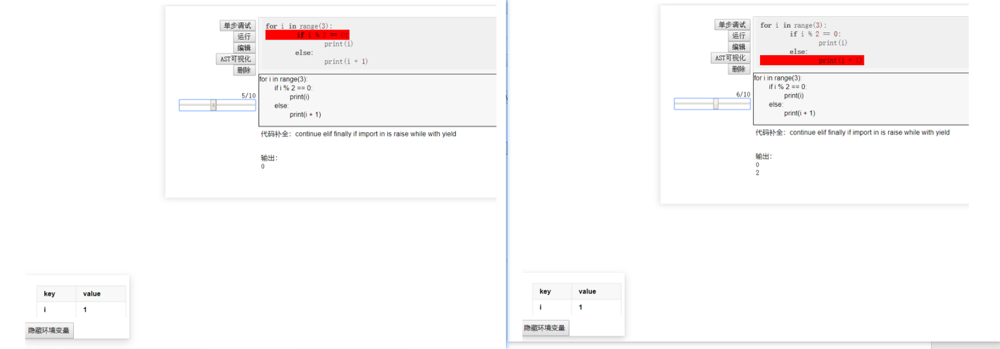
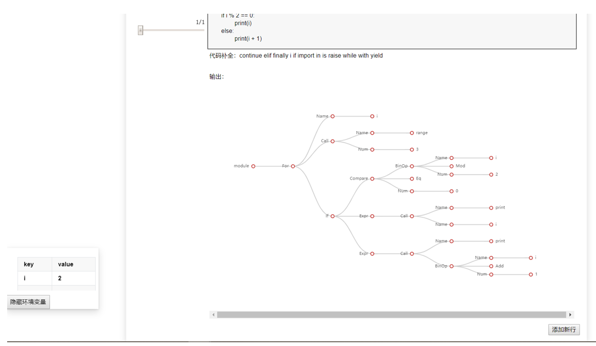

## 在线python程序设计——fake_jupyter

> 1700012886 张克驰

[TOC]

### 项目介绍

- 基于Flask设计一个交互式的在线python程序设计项目

#### 需求分析

- 一个良好且友好的python执行环境，对于学习python并理解语法有着重要的作用
- 本次项目的目标即为python新手提供一个方便调试、方便观察变量变化的交互式web应用
- 因此我们需要有较好的交互方式（使用jquery+AJAX的方式实时交互）以及较为完善的调试系统（支持bug定位、单步调试、环境变量监测等功能），同时需要方便使用（代码高亮、代码补全）
- 同时，为了方便用户对python程序有一个大致的认识，这里将程序语言中一个重要的结构：AST树进行可视化，并设置了充足的交互方式

#### 主要功能

- 支持功能包括：
  - 代码编辑、代码高亮、简单的代码补全提示、程序在线运行、简单的bug定位、单步调试、AST可视化、环境变量实时监测打印等

  - 支持多用户使用，用户间运行环境独立不受影响

- 使用的学期内知识包括：
  - Flask网页设计、jquery、AJAX刷新、python修饰器功能、echarts可视化、表格设计等

### 选题难度和完成程度

- 整个选题的难度集中在对python内部执行逻辑的修改，以及对输入输出重定向的实现，整体需要对python程序的底层执行过程有一个大致的了解
- 为了实现这样的操作，我翻看了大量资料，包括python原版的document：<https://docs.python.org/3/library/custominterp.html>以及相关的代码：<https://github.com/python/cpython/blob/3.8/Lib/code.py>，整体难度较大
- 自认为整体的实现上是**比较成功和完善的**，且通过这个项目**对python的底层执行逻辑有了更深刻的认识**

### 重难点分析与实现思路

#### 在Python中如何执行代码？

- Python作为一门高级编程语言，其内部封装了一些系统调用函数和内置函数
  - 我们可以采用内置函数exec() 来执行一段代码
  - exec(object[, globals[, locals]])

#### 如何获取运行结果的？

- 进行输出重定向
- `from io import StringIO`，将输入输出流导向字符串中（这里图省事没有做输入流的重定向）
  - 同时自定义python修饰符，方便我们对函数进行重定向操作

#### 如何获取代码异常信息？

- 使用Python的内建类：code类
- 
- 只需要派生并重构这个类，将报错信息和输出结果重定向到我们需要的位置即可

#### 如何实现单步调试？

- 使用system中的trace函数对运行时栈堆进行跟踪
- sys.settrace(trace_func)，设定一个trace函数，即可在代码执行过程中跟踪代码的运行情况和栈堆变化
- 通过分析这些变化，可以还原代码的运行情况
- 比如：
  - 
  - 其栈堆信息的输出为：
  - 

#### 如何可视化代码？

- 使用AST抽象语法树，通过设定上下文无关文法将字符串（代码）转化为AST树结构
- Python同样有相应的内置库ast，可以将代码转化成为AST树结构
- AST树反映了一个代码的逻辑结构
- 这部分代码参考了论文中的设计：
  - Daniel C. Wang, Andrew W. Appel, Jeffrey L. Korn, and Christopher S. Serra. 1997. The Zephyr abstract syntax description language. In Proceedings of DSL
  - 部分代码借鉴了TRANX: A Transition-based Neural Abstract Syntax Parser for Semantic Parsing and Code Generation的实现

#### 实现简单的代码补全

- Python的keyword.kwlist为python的关键字，加上已经定义的变量，组成了总的候选词
- 对代码进行切分词处理后，最后一个词与候选词内的词进行比对，看是否是子串
- 这样就实现了对输入代码补全的简单操作

### 具体实现介绍

- 后端端口实现：
  - / ：返回主页
  - /runCode：运行代码，返回运行结果
  - /runLocal：获取当前环境变量
  - /getKeywords：根据代码，返回代码补全预测结果
  - /runStep：分步运行代码，返回按时间步组织的结果
  - /getAST：获取代码的AST树

- 一些重要的类介绍：
  - myPython类：
    继承了code.InteractiveInterpreter，对一些成员函数进行重写，对结果重定向
    同时增加了runcode_step函数，使用trace_func分步跟踪代码运行环境，并根据返回信息还原每一步的运行结果
    这是负责代码运行的类，每一个cookie对应一个myPython对象，每一个myPython对象对应一个运行环境，互相之间互不干扰
  - consoleList类：
    myPython的管理类，核心是一个字典，根据cookie获取myPython对象
  - AbstractSyntaxTree类：
    对python中ast的结果进行包装的类
    利用该类可以将python ast转化为更加方便操作的树结构
  - ASDLGrammar类：
    对python的文法进行了部分简化
    核心文法的设计借鉴了一篇经典论文中的设计，即ASDL文法
- 前端一些重点实现
  - 代码高亮采用了highlight.js包
  - 支持输入制表符tab
    - 一个冷知识：在网页的输入框中默认是输入不进去tab的，可以用百度搜索试试
    - 解决方法：
      因为tab键默认是切换元素功能，因此需要修改其功能
      可以使用keydown来实现，keydown绑定事件时检测按下的键是否（e.which == 9）
      然后手动在输入框里加一个’    ‘就可以了
    - 但焦点处理上仍有一些问题（遗留bug）

- 使用`<mark>`标签进行代码行的高亮标记
- 使用echarts中的tree对AST进行作图

### 项目最终实现和使用说明

- 整体界面：

  - 仿照了jupyter的设计，可以分块编辑执行代码
  - 一个cookie对应一个代码运行环境
  - 当前选中的块会被蓝色边框圈起来高亮显示，同时左侧的框中可以进行操作

  

- 代码运行结果和bug报错会在输出区显示出来，同时bug出错的行会被黄色高亮

  

- 单步调试时会用红色高亮当前执行的代码行，同时可以使用左侧的滑槽进度条控制当前执行步

  - 输出区和环境变量区会随着不同的执行步而发生相应的变化

  

- 编辑按钮会将代码美化区域中已经存在的代码拷贝到编辑区中方便编辑
- 删除区域会将选中的代码块删除掉
- 其他按钮在执行时也会对代码进行美化，并显示在代码美化区域中

- AST可视化会对输入的代码进行结构分析，并画出其AST图

  

  - AST图支持收缩和伸展操作，可以对某个子树是否显示进行控制
  - 由于地方不太够，竖着画不好看，为了照顾美观性，将整个AST树横着画出来

### 本地搭建和体验方法

- 代码中尽可能的减少对外置库函数的依赖，尽量使用python的内置库进行核心逻辑的实现
- 但项目中仍不可避免的使用到下列库：
  - contextlib
  - re
  - flask
- 如果您希望本地搭建本项目，可以运行项目文件中的main.py，即执行`python main.py`，项目默认在flask debug模式下运行，可访问`http://127.0.0.1:5000`地址使用

- 项目开源于我的github中：<https://github.com/zkcpku/fake_jupyter>