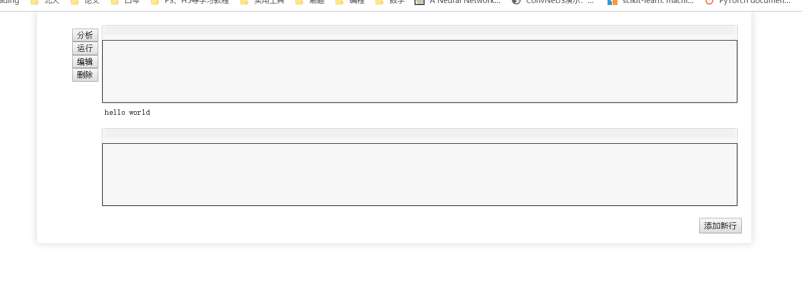

## 在线Python程序设计

> 张克驰 1700012886

[TOC]

### 功能设计：

- 基于Flask框架，设计一个可撰写Python代码、运行，并可将结果返回在界面中的项目程序
- 整体的功能设计希望能够和在线python环境 ***jupyter***一样，在部分功能上进行简化
- 基本功能包括：
  - 支持代码编辑
  - 代码高亮
  - 代码结果的展示（如果有能力的话，可以继续设计对表格、图表输出结果的支持）
  - 代码静态分析，在运行前提示可能存在的bug
  - 程序的AST树构建和可视化分析
  - 历史变量的记录与展示
  - 简单的代码补全（依赖静态分析结果）

### 大致思路

#### 前端

- 借鉴了***jupyter***页面的样式，目前已基本完成功能区的规划
- 

#### 后端

- 设计端口进行交互，采用AJAX的方式，对前端页面进行动态刷新

- 代码静态分析部分决定采用**字符串分析** + **静态分析工具**的方式进行

- AST树的展示部分决定借鉴ASDL语法，并使用echart进行绘图，这部分是我在软件所实习时学到的东西，希望能够尽量应用上

  

### 难点

- 难点集中在静态分析和AST树构建上，目前有几种实现思路：
  - 使用pdb库进行调试信息的生成
  - 使用字符串分割的方法，将token划分出来，利用规则分析命名是否正确
  - 使用code库进行交互式环境的保存与分析
  - 使用subprocess或者exec进行代码运行，得到运行结果
  - 或者还有一个解释器byterun，但需要学习
  - AST树的构建决定使用python自带的ast库+自定义ASDL规则进行生成